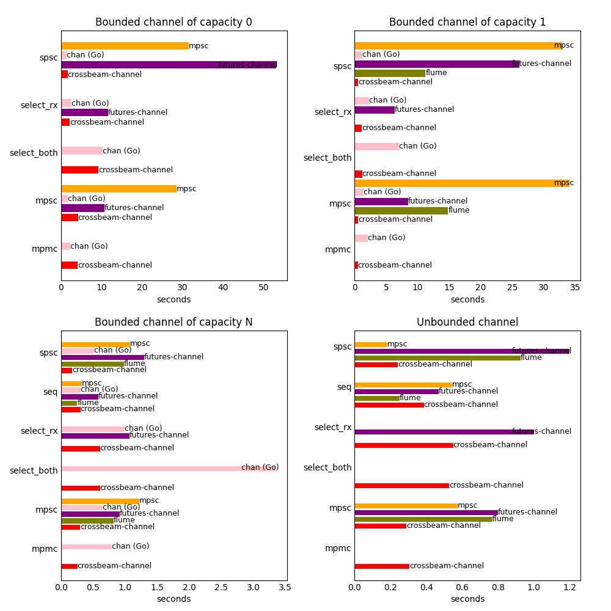

# Benchmarks

### Tests

* `seq`: A single thread sends `N` messages. Then it receives `N` messages.
* `spsc`: One thread sends `N` messages. Another thread receives `N` messages.
* `mpsc`: `T` threads send `N / T` messages each. One thread receives `N` messages.
* `mpmc`: `T` threads send `N / T` messages each. `T` other threads receive `N / T` messages each.
* `select_rx`: `T` threads send `N / T` messages each into a separate channel. Another thread receives `N` messages by selecting over the `T` channels.
* `select_both`: `T` threads send `N / T` messages each by selecting over `T` channels. `T` other threads receive `N / T` messages each by selecting over the `T` channels.

Default configuration:

- `N = 5000000`
- `T = 4`

### Running

Runs benchmarks, stores results into `*.txt` files, and generates `plot.png`:

```
./run.sh
```

Dependencies:

- Rust 
- Go
- Bash
- Python 
- Matplotlib

### Results

Machine: Intel(R) Core(TM) i7-5500U (2 physical cores, 4 logical cores)

Rust: `rustc 1.63.0 (4b91a6ea7 2022-08-08)`

Go: `go version go1.19 linux/amd64`

Commit: `7070018` (2022-08-24)


